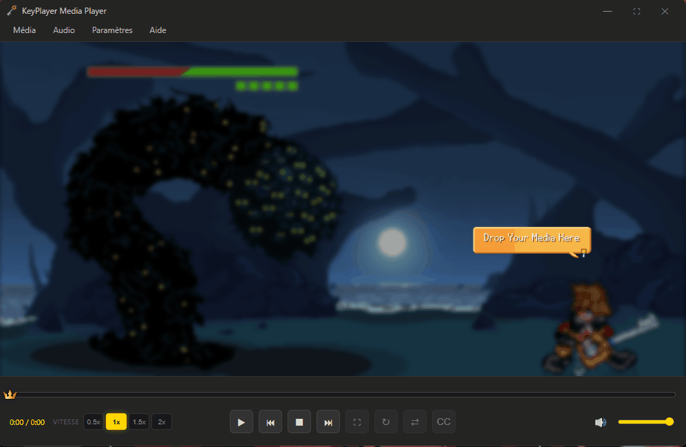

# 🗝️ KeyPlayer Media Player

**KeyPlayer** is a minimalist and immersive media player deeply inspired by the **Kingdom Hearts** aesthetic. Designed with Electron, it features a custom "Dark Mode" interface and smooth animations to provide a unique multimedia experience.



## ✨ Features

* 🎬 **Multi-format Playback**: Support for `.mp4`, `.mkv`, `.webm`, `.mp3`, `.flac`, and more.
* 🐉 **Drag & Drop**: Simply drop your files into the player to start the magic instantly.
* 🎮 **Discord Rich Presence**: Share your current status (what you're watching or listening to) live on your Discord profile.
* 🖼️ **Frameless Interface**: A clean, borderless design with custom Kingdom Hearts-style controls.
* 📂 **File Association**: Set KeyPlayer as your default player for a fully integrated experience.

## 🚀 Installation

Ready to use? You can download the latest standalone version from the **Releases** section.

1. Go to [Releases](https://github.com/CeriseeBrandy/keyplayer/releases).
2. Download `KeyPlayer-Setup-1.0.0.exe`.
3. Run the installer (and enjoy the custom Sora artwork!).
4. May your media be your guiding key!


## 🎨 Credits & Acknowledgments

### Development
* **Lead Developer**: [CeriseeBrandy](https://github.com/CeriseeBrandy)

### Art & Inspiration
* **Background Artwork**: [Sora - Kingdom Hearts III](https://nolwennleroy.artstation.com/projects/xzk4lY) by **Nolwenn Leroy**.
* **Sora Character Art**: [Sora Fanart](https://www.deviantart.com/braveshyguy/art/Sora-385003426) by **BraveShyGuy**.
* **Inspiration**: The Kingdom Hearts saga, property of Square Enix and Disney.

### Technologies
* **Framework**: Electron
* **Media Engine**: Node-MPV
* **Rich Presence**: Discord-RPC


## 🛠️ Development Setup

If you want to explore the code or build the project yourself:

```bash
# Clone the repository
# (Or download the ZIP and extract it)

# Install dependencies
npm install

# Run in development mode
npm start

# Build the Windows installer
npm run build
